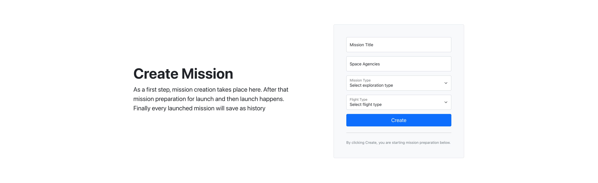
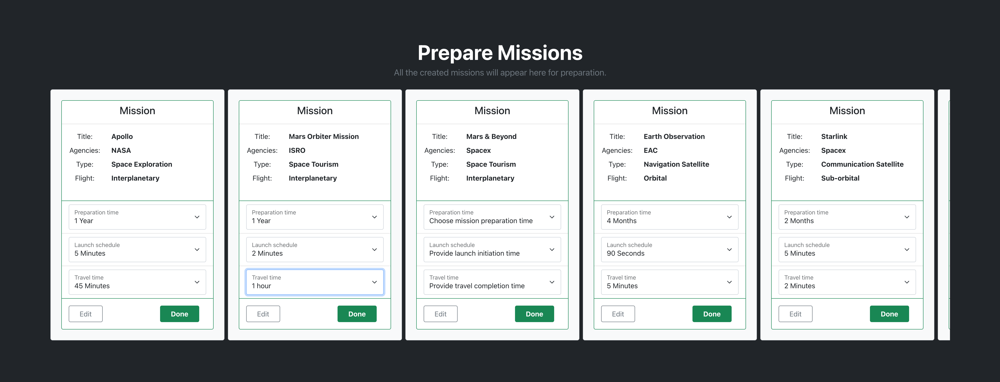
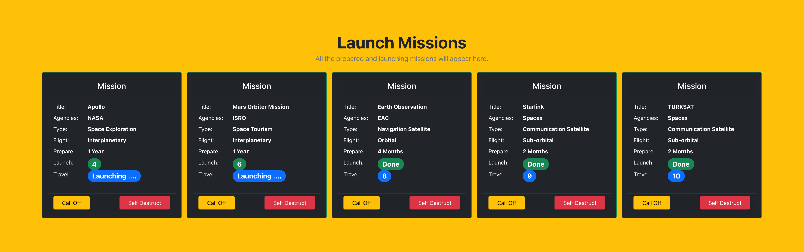

# space-launch

## description:

This project was bootstrapped with [Create React App](https://github.com/facebook/create-react-app), using the [Redux](https://redux.js.org/, [Redux Toolkit](https://redux-toolkit.js.org/) and [Bootstrap styles](https://getbootstrap.com/) template.
- The functionality of this project/app is to ***manage the space missions***.
- It has multiple stages and each stage having a step of mission state. Those are **Create Mission**, **Prepare Mission**, **Launch Mission**, and **Mission History**.

## Function:

In this section we will go through every step of functionality:

### Create Mission:
- Here we on-board a mission with initial design and plan.
- Create Mission form submission will indicate that mission is ready for preparation/assembly state.

### Prepare Mission:
- Here we provide the time for preparation, launch schedule time, and travel time. 
- The next / **Done** state of this mission prepare will be launch mission and the previous stage is to send the mission back to create mission section for **edit**

### Launch Mission:
- Here we will just observe the mission launch.
- We can do the last minute **call-off** and send the mission back to prepare-mission state of we can do the **self destruct** to remove this mission from launch observation list
- If neither call-off nor self-destruct has used then mission will go to mission history state aftereverything completes.

### Mission History:
- This is the final stage of mission launch management. So all the completed launched missions will be placed here as **mission history**.
- It contains very all the information of the missions launched.

## Available Scripts

In the project directory, you can run:

### `npm start`

Runs the app in the development mode. 
Open [http://localhost:3000](http://localhost:3000) to view it in the browser.

The page will reload if you make edits. 
You will also see any lint errors in the console.

### `npm test`

Launches the test runner in the interactive watch mode. 
See the section about [running tests](https://facebook.github.io/create-react-app/docs/running-tests) for more information.

### `npm run build`

Builds the app for production to the `build` folder. 
It correctly bundles React in production mode and optimizes the build for the best performance.

The build is minified and the filenames include the hashes. 
Your app is ready to be deployed!

See the section about [deployment](https://facebook.github.io/create-react-app/docs/deployment) for more information.

### `npm run eject`

**Note: this is a one-way operation. Once you `eject`, you can’t go back!**

If you aren’t satisfied with the build tool and configuration choices, you can `eject` at any time. This command will remove the single build dependency from your project.

Instead, it will copy all the configuration files and the transitive dependencies (Webpack, Babel, ESLint, etc) right into your project so you have full control over them. All of the commands except `eject` will still work, but they will point to the copied scripts so you can tweak them. At this point you’re on your own.

You don’t have to ever use `eject`. The curated feature set is suitable for small and middle deployments, and you shouldn’t feel obligated to use this feature. However we understand that this tool wouldn’t be useful if you couldn’t customize it when you are ready for it.

## Learn More

You can learn more in the [Create React App documentation](https://facebook.github.io/create-react-app/docs/getting-started).

To learn React, check out the [React documentation](https://reactjs.org/).
